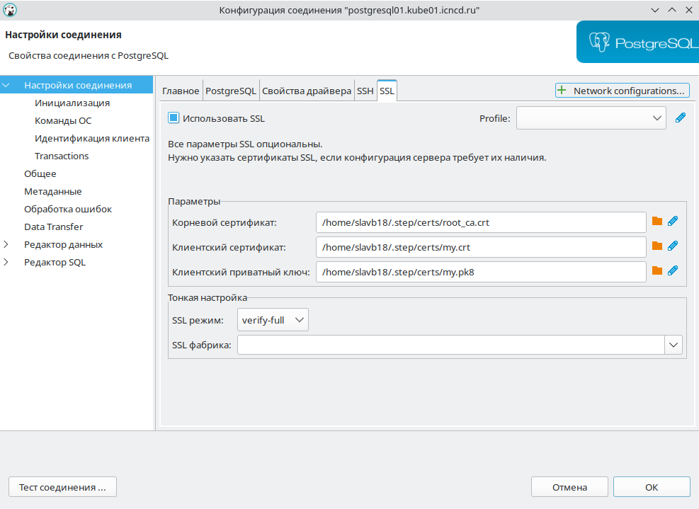
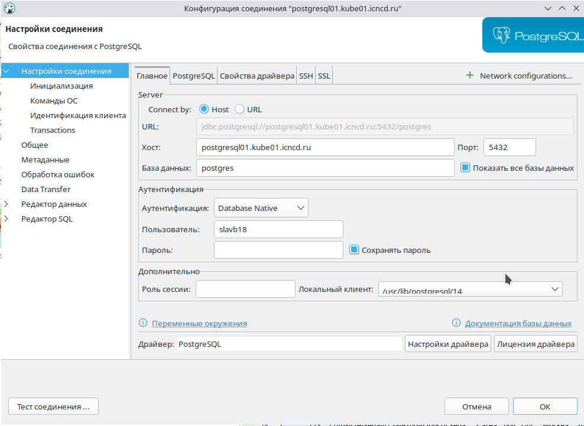

# iconicluster

## подключитесь к кластеру
1. Добавьте электронную почту **MY-LOGIN@iconicompany.com** на https://github.com/settings/emails и сделать ее основной (Primary).
2. **Получите сертификат** `curl -L https://github.com/iconicompany/iconicluster/raw/main/step-ca/install/step-cli-user.sh | bash -`
Если скрипт выдает ошибку, [поставьте step самостоятельно](https://github.com/smallstep/cli/releases) и запустите скрипт заного.
4. Сохраните [config](https://github.com/iconicompany/iconicluster/blob/main/examples/config) 
в `$HOME/.kube/config`, измените `${USER}` на себя. **Можно сделать командой:**
`curl -L https://github.com/iconicompany/iconicluster/raw/main/examples/config|envsubst > $HOME/.kube/config`
5. Подключитесь к k8s через k9s
[Скрипт установки для k9s](https://github.com/iconicompany/osboxes/raw/master/ubuntu/apps/k9s.sh) 
6. Подключитесь к Postgresql: `psql -h postgresql01.kube01.icncd.ru postgres`.

Команда для проверки subject сертифката:
`openssl x509 -noout -subject -in $HOME/.step/certs/my.crt`
Должна вывести subject=C = ru, O = iconicompany, OU = users, CN = MY-LOGIN

## Таблица сравнения ручной и автоматизированной выкладки проектов:

| **Критерий**                          | **Ручная выкладка**                                                                 | **Автоматизированная выкладка (k3s, Docker, Helm)**                               |
|----------------------------------------|-------------------------------------------------------------------------------------|-----------------------------------------------------------------------------------|
| **Скорость выкладки**                  | Медленная: каждый шаг выполняется вручную, ожидание подтверждений.                   | Быстрая: выкладка автоматизирована, каждый этап запускается в pipeline.           |
| **Необходимость общения с админом**    | Постоянная: требуется запрос на настройку серверов, БД, сертификатов, учетных записей.| Минимальная: админы ревизуют Dockerfile и Helm-чарты, остальное через CI/CD.      |
| **Настройка базы данных**              | Ручная: админы создают и настраивают БД отдельно под каждый проект.                  | Автоматическая: через Helm-чарты, Terraform, или интеграцию с существующими БД.   |
| **Выпуск сертификатов**                | Ручной процесс, требующий запроса и времени на обработку.                            | Автоматический: step-ca выписывает сертификаты в процессе деплоя.                 |
| **Создание учетных записей**           | Ручная настройка через админов.                                                     | Автоматизировано через системы OAuth и управление доступом (Dex, LDAP).           |
| **Повторяемость среды**                | Не гарантирована: каждый админ может настроить окружение по-разному.                 | Идентична на всех этапах (devel, test, prod) благодаря контейнерам и Helm-чартам. |
| **Масштабирование**                    | Ручное: нужно координировать с админами для увеличения мощностей.                    | Автоматическое: автоскейлинг на уровне k3s и Kubernetes.                          |
| **Устойчивость к ошибкам**             | Низкая: требуется ручное вмешательство при сбоях или падениях сервисов.               | Высокая: автоматическое восстановление сервисов в кластере (self-healing).        |
| **Обновления и деплой**                | Зависит от расписания админов, часто приходится ждать окна для обновлений.           | Автоматизировано через GitOps и CI/CD: релизы из коммитов или pull request-ов.    |
| **Обратная связь**                     | Задержка: нужно дожидаться откликов админов и ручных операций.                      | Мгновенная: CI/CD предоставляет логи и статусы в реальном времени.               |
